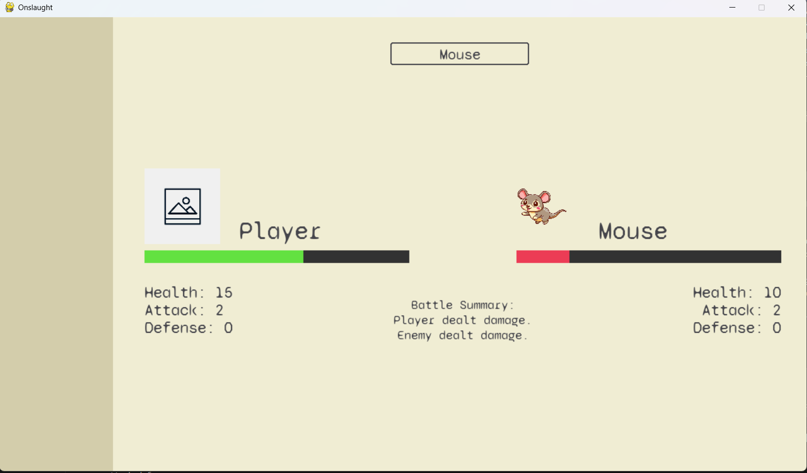
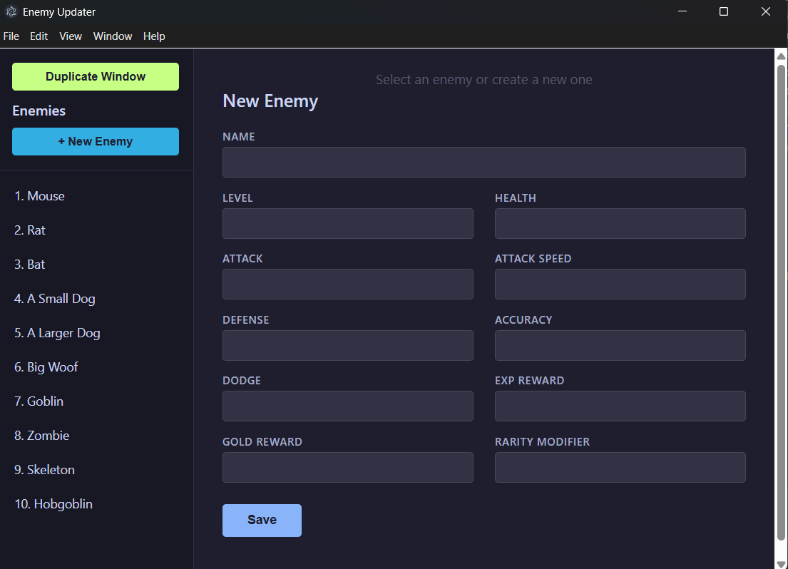

# Onslaught

A remake of AutoBattle RPG. An incremental, mostly text-based autobattling RPG built with Python and Pygame. Fight hundreds of monsters, collect unique equipment, and build your character to get infinitely stronger!



## Table of Contents

- [Status](#status)
- [Features](#features)
- [Installation](#installation)
- [Usage](#usage)
- [Dev Tools](#dev-tools)
- [Project Structure](#project-structure)

## Status

Work in progress. Core battle system, enemy selection, and UI rendering are functional. Player and enemy stats are partially implemented. Several widgets and tools have been built for the UI and data manipulation.

## Features

- **Real-time Auto-Battle System** - Player and enemy exchange attacks automatically based on individual attack speed timers
- **Enemy Selection** - Browse and select enemies from a scrollable dropdown menu
- **Stat System** - Full RPG stat suite for both player and enemies: health, attack, attack speed, defense, accuracy, dodge. In progress: Special stats like leech and regen.
- **Progression** - Earn EXP and gold from defeating enemies. WIP: occasionally find items, and level up.
- **Battle UI** - Portraits, health bars, stat panels, and battle summary widgets
- **JSON-driven Enemy Data** - Enemy definitions stored in `enemies.json` for easy editing and tooling
- **Custom Widgets** - Scrollable dropdown, health bars, battle summary widget, and left menu panel
- **Logging** - Built-in logger for development and debugging

## Installation

Ensure you have Python 3.x installed.

Clone the repository:
```bash
git clone <your-repo-url>
cd onslaught-game
```

Install dependencies:
```bash
pip install -r requirements.txt
```

## Usage

Run the game from the `src` directory:
```bash
cd src
python main.py
```

### Controls

- **Dropdown**: Click to open, scroll or drag to navigate, click to select an enemy
- **ESC**: Close dropdown
- **X**: Close window

## Dev Tools

The `dev/` directory contains custom-built tools for streamlining game development, specifically around enemy data management.

### Enemy Updater (Electron GUI)



**Location:** `dev/enemy_updater/`

A desktop GUI application built with Electron for visually managing enemy data. It reads from and writes directly to `src/data/enemies.json`.

**Features:**
- Browse all enemies in a sidebar list
- Create new enemies with a form-based editor
- Edit existing enemy stats (name, level, health, attack, attack speed, defense, accuracy, dodge, EXP reward, gold reward, rarity modifier)
- Delete enemies with confirmation
- Duplicate the window to compare enemies side-by-side
- Saves changes directly to the game's data file

**To run:**
```bash
cd dev/enemy_updater
npm install
npm start
```

Requires Node.js and npm.

### Create Enemies (CLI Script)

**Location:** `dev/create_enemies.py`

A command-line Python script for rapidly adding multiple enemies to `enemies.json` in sequence. Prompts for each stat field and appends new entries to the existing data file. Type `!` when prompted to continue to finish and save.

**To run:**
```bash
python dev/create_enemies.py
```

### Generate Enemies (Planned)

**Location:** `dev/generate_enemies.py`

A planned script for procedurally generating late-game enemies by applying scaling equations to the stats of existing enemies. Not yet implemented.

## Project Structure

```
onslaught-game/
├── assets/
│   ├── fonts/              # Game fonts
│   └── images/             # Sprites and portraits
├── dev/
│   ├── create_enemies.py   # CLI tool for batch-adding enemies
│   ├── generate_enemies.py # (Planned) Procedural enemy generator
│   └── enemy_updater/      # Electron GUI for managing enemy data
│       ├── index.js         # Main process (file I/O, window management)
│       ├── renderer.js      # UI logic (list, editor, save/delete)
│       ├── index.html       # Editor layout
│       ├── styles.css       # Styling
│       └── package.json     # Electron dependencies
├── src/
│   ├── main.py              # Entry point, game loop, event handling
│   ├── draw.py              # Rendering and UI drawing
│   ├── data/
│   │   ├── constants.py     # Colors, fonts, game constants
│   │   ├── enemies.json     # Enemy definitions (JSON)
│   │   ├── enemy.py         # Enemy class and registry
│   │   └── player.py        # Player class
│   ├── widgets/
│   │   ├── battle_widget.py # Battle summary and stat display
│   │   ├── dropdown.py      # Custom scrollable dropdown
│   │   ├── health_bar.py    # Health bar widget
│   │   └── left_menu.py     # Left menu panel
│   ├── logic/
│   │   └── battle.py        # Battle system and combat logic
│   └── utils/
│       └── logger.py        # Logging setup
├── requirements.txt
└── README.md
```
